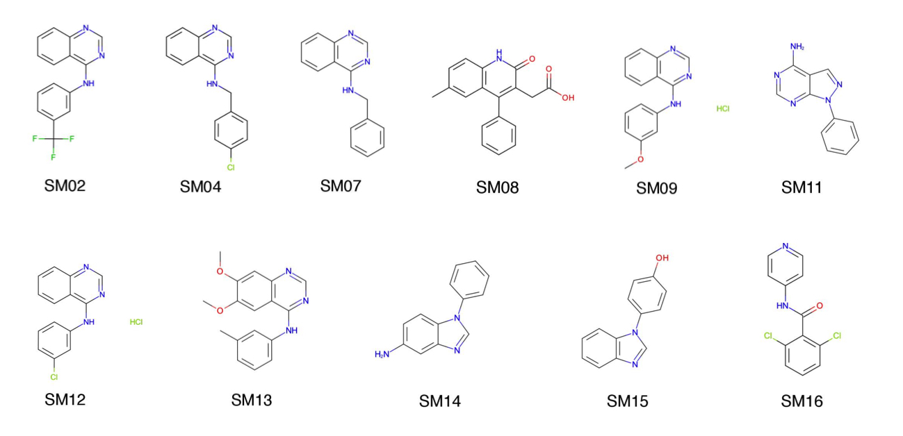

# SAMPL6 log *P* Challenge Instructions

SAMPL6 was originally announced as featuring a log *D* prediction challenge, but there were difficulties in the collection of experimental data as we explain in “Experimental Details” section below. 
We were instead able to collect experimental neutral-compound log partition coefficients (log *P*) for a subset of the SAMPL6 pKa challenge compounds. 
Thus, these form the basis of  SAMPL6 Part II -- a log *P* prediction challenge commencing immediately. 
We hope that the log *P* challenge will be useful in investigating sources of modeling errors that impact solvation, partition, and affinity predictions other than protonation state related errors that were prominent in SAMPL5 log *D* challenge.  

This challenge consists of predicting the octanol-water partition coefficients (log *P*) of 11 small molecules that resemble fragments of small molecule protein kinase inhibitors. 
Our aim is to evaluate how well current models can capture the transfer free energy of small molecules between different solvent environments through blind predictions.

log *P*oct/wat = log10 ( [unionized solute]octanol / [unionized solute]water ) 

Participants are encouraged to submit articles evaluating their methods to the coming special issue or section of the Journal of Computer-Aided Molecular Design special issue targeting September 2019. 
The challenge will culminate with a joint D3R/SAMPL workshop.
The following subsections describe the molecules included in this challenge, the experimental conditions and measurements, the quantities to be predicted, and how prediction results must be submitted.

## Challenge Timeline

- Nov 1, 2018  -  SAMPL6 Part II Challenge start date
- Mar 15, 2019  -  Challenge submissions due 
- Mar 18, 2019  -  Experimental data release date 
- May 16, 2019  -  SAMPL6 log *P* challenge virtual workshop
- Aug 22-23, 2019  -  Joint D3R/SAMPL workshop, San Diego 
- Sep 15, 2019  -  JCAMD special issue submissions due 

Your predictions must be uploaded on the [D3R SAMPL6 web-page](https://drugdesigndata.org/about/sampl6) by March 15th, 2019. 
The experimental results will be released immediately after the challenge closes. 

# Motivation

Distribution coefficients (log *D*) replaced hydration free energies in SAMPL5 challenge and provided great insight into the importance of modeling a variety of physical effects (overview doi:10.1007/s10822-016-9954-8 and experiment doi:10.1007/s10822-016-9971-7; JCAMD special issue https://link.springer.com/journal/10822/30/11/page/1). 
log *D* values capture the same properties as hydration free energies, namely, solvation in the respective solvents. 
In many SAMPL5 submissions, they were predicted as if they were partition coefficients (log *P*). 
The difference between log *D* (which reflects the transfer free energy at a given pH including the effects of accessing all equilibrium protonation states of the solute in each phase) and log *P* (which reflects the free energy of transfer for the neutral form only) proved particularly important. 
In some cases, other effects like the presence of a small amount of water in cyclohexane may also have played a role.

Because the SAMPL5 log *D* challenge highlighted the difficulty in correctly predicting transfer free energies involving protonation states (the best methods with RMSE of 2.5 log units [1]), we aimed to isolate the protonation and partition prediction components into two different challenges in SAMPL6. 
Participants are asked to predict the partition coefficient log *P* of the neutral species between octanol and water phases.

Partition coefficient prediction as a model problem embodies important elements of the physical chemistry of protein-ligand binding affinity prediction, while making it far easier to probe the accuracy of computational tools used to model protein-ligand interactions and to identify and correct sources of error. 
For physical modeling approaches, evaluation of partition coefficient predictions is a means of separating force field accuracy from sampling and protonation state modeling challenges. Protein-ligand binding equilibrium is like a partitioning between two environments: protein binding site and aqueous phase. 
Methods that employ thermodynamic cycles, such as free energy calculations, can therefore employ similar strategies as they would for calculating binding affinities.  
On the other hand, partition coefficient prediction omits the difficulties of conformational sampling of proteins and treatment of protonation states. 

We believe SAMPL6 logP challenge will benefit improvement of solvation, partition/distribution coefficient and affinity prediction methods, as well as other components of molecular modeling methods such as force fields, sampling algorithms, and prediction of prospective model inaccuracies. 
One of the goals of this challenge is to encourage prediction of model uncertainties (an estimate of the inaccuracy with which your model predicts the physical property), since the ability to tell when methods will be successful or not would be very useful for increasing the application potential and impact of computational methods.

## 11 small molecules are included in log *P* challenge

**Fig 1. SAMPL6 logP Challenge molecules.** These molecules are a subset of the SAMPL6 pKa Challenge set. 

